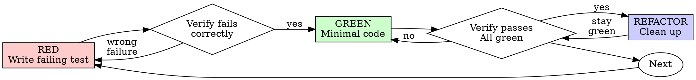

**Core principle:** When TDD is appropriate, verify expected behavior with
a focused test, implement the smallest justified change, and validate
proportionally. Preserve existing work and report unrelated failures
without modifying them automatically.

# Test-Driven Development (TDD)

## Overview

Write the test first. Watch it fail. Write minimal code to pass.

**Core principle:** If you didn't watch the test fail, you don't know if it tests the right thing.

**Violating the letter of the rules is violating the spirit of the rules.**

## Language and Tooling Selection

TDD is language-agnostic.

Select the programming language, test framework, test runner, commands,
and conventions from the actual project.

Examples in this Skill are illustrative, not mandatory technology choices.

Do not assume TypeScript, JavaScript, npm, Jest, Python, Java, or any other
technology unless repository inspection confirms it.

Prefer the project's existing test infrastructure.

Do not add a test framework or dependency without a justified benefit.

## When to Use

TDD is recommended for:

- new or changed business behavior
- bug fixes with reproducible behavior
- regression prevention
- changes to important contracts
- refactoring where tests can protect existing behavior

Use a proportionate approach for:

- documentation-only changes
- formatting-only changes
- generated files
- configuration changes where behavior tests provide no meaningful value
- throwaway prototypes

When tests are not appropriate, explain why and use the smallest
appropriate validation method.

## Core Cycle

For new behavior, prefer:

1. Write a focused test for the expected behavior.
2. Execute it and verify that it fails for the intended reason.
3. Implement the minimum code required to pass.
4. Execute the relevant tests.
5. Refactor only when justified.
6. Re-run the relevant tests after refactoring.

A test that fails for an unrelated setup error does not establish that the
intended behavior is missing.

## Existing Implementation and Workspace Safety

If implementation code already exists before a test is written:

- Never delete it merely to comply with TDD.
- Never discard uncommitted user changes.
- Do not reset, clean, overwrite, or replace a user's workspace.
- Write a regression test representing the expected behavior.
- Run the test against the existing implementation when possible.
- If it fails, use the failure as evidence before changing the code.
- If it passes, assess whether it provides meaningful independent
  protection for the requirement.
- Continue with the smallest justified correction or refactoring.

If the code belongs to a colleague's PR under review, do not modify it.
Generate feedback only.

TDD never authorizes destructive operations.

## Existing Project Conventions

Before writing tests, inspect:

- test framework and version
- available test commands
- file naming conventions
- fixtures and test utilities
- mocking conventions
- test database or service setup

Prefer established project conventions over introducing new tooling.

Do not claim that a test passed unless it was executed successfully.

## Red-Green-Refactor



### RED - Write Failing Test

Write one minimal test showing what should happen.

<Good>
```typescript
test('retries failed operations 3 times', async () => {
  let attempts = 0;
  const operation = () => {
    attempts++;
    if (attempts < 3) throw new Error('fail');
    return 'success';
  };

const result = await retryOperation(operation);

expect(result).toBe('success');
expect(attempts).toBe(3);
});

````
Clear name, tests real behavior, one thing
</Good>

<Bad>
```typescript
test('retry works', async () => {
  const mock = jest.fn()
    .mockRejectedValueOnce(new Error())
    .mockRejectedValueOnce(new Error())
    .mockResolvedValueOnce('success');
  await retryOperation(mock);
  expect(mock).toHaveBeenCalledTimes(3);
});
````

Vague name, tests mock not code
</Bad>

**Requirements:**

- One behavior
- Clear name
- Real code (no mocks unless unavoidable)

### Verify RED — Watch It Fail

When using TDD for new behavior:

1. Run the focused test using the test command identified from the project.
2. Confirm that it fails for the expected behavioral reason.
3. Distinguish an expected test failure from a test setup or infrastructure
   error.

If the test passes immediately, determine whether it correctly represents
new behavior or existing behavior. Do not force a failure merely to comply
with the process.

If the test cannot execute, report the limitation and investigate only the
necessary setup issues.

TDD is preferred for new behavior, not a reason to create meaningless tests
for documentation-only or otherwise non-behavioral changes.

### Verify GREEN — Watch It Pass

After implementing the minimum change:

1. Run the focused tests.
2. Run additional relevant tests based on the change's risk and the
   project's conventions.
3. Run broader validation when required by project policy or when the
   change's impact justifies it.
4. Report failures accurately, including known pre-existing failures.

Do not change unrelated code merely to make an unrelated test pass.

Do not claim that the implementation is fully validated when relevant
checks remain unexecuted.

### REFACTOR - Clean Up

After green only:

- Remove duplication
- Improve names
- Extract helpers

Keep tests green. Don't add behavior.

### Repeat

Next failing test for next feature.

## Good Tests

| Quality          | Good                                | Bad                                                 |
| ---------------- | ----------------------------------- | --------------------------------------------------- |
| **Minimal**      | One thing. "and" in name? Split it. | `test('validates email and domain and whitespace')` |
| **Clear**        | Name describes behavior             | `test('test1')`                                     |
| **Shows intent** | Demonstrates desired API            | Obscures what code should do                        |

When writing or changing any test, read [writing-good-tests.md](writing-good-tests.md) for the rules that keep tests honest:

- Name the production change that would make the test fail — before writing it
- Assert on real behavior, never on mock behavior
- Keep test-only code in test utilities, out of production classes
- Understand a dependency's side effects before mocking it

## Common Testing Decisions

| Situation                             | Recommended response                                                                                                    |
| ------------------------------------- | ----------------------------------------------------------------------------------------------------------------------- |
| New behavior                          | Prefer writing a focused test before implementation and verify that it fails for the expected reason.                   |
| Existing implementation without tests | Add a meaningful regression test and run it against the existing implementation.                                        |
| Existing test passes                  | Determine whether it independently protects the requirement. Do not force a failure merely to satisfy the TDD sequence. |
| Documentation-only change             | Use documentation checks and other proportionate validation instead of adding meaningless tests.                        |
| Difficult test setup                  | Investigate the existing test utilities and simplify the testable boundary when justified.                              |
| Exploratory implementation            | Preserve useful work. Use focused tests to establish expected behavior before further changes when appropriate.         |
| Expensive full test suite             | Run focused tests first and select broader validation according to risk, project policy, and available CI.              |
| Existing code is difficult to test    | Consider a minimal, justified refactor without rewriting unrelated functionality.                                       |

## Review Before Rewriting

A failed test may justify changing implementation code. It does not
automatically justify replacing an entire implementation.

Before rewriting existing code:

1. Identify the specific requirement or defect.
2. Establish evidence with a relevant test or another appropriate check.
3. Inspect existing behavior and dependencies.
4. Evaluate the smallest safe correction.
5. Explain why a larger rewrite is necessary if one is proposed.
6. Preserve unrelated changes.

Never delete existing implementation or user work merely because it was
written before a test.

TDD guides the development process. It does not override workspace safety,
task scope, or human approval requirements.

## Example: Bug Fix

**Bug:** Empty email accepted

**RED**

```typescript
test("rejects empty email", async () => {
  const result = await submitForm({ email: "" });
  expect(result.error).toBe("Email required");
});
```

**Verify RED**

the project's targeted test command

**GREEN**

```typescript
function submitForm(data: FormData) {
  if (!data.email?.trim()) {
    return { error: "Email required" };
  }
  // ...
}
```

**Verify GREEN**

the project's targeted test command

**REFACTOR**
Extract validation for multiple fields if needed.

## Verification Checklist

Before marking work complete, evaluate:

- [ ] Relevant behavior has appropriate test coverage.
- [ ] New behavior tests were verified to fail for the expected reason
      when using the TDD cycle.
- [ ] Regression tests protect important fixed behavior.
- [ ] Tests use meaningful assertions.
- [ ] Relevant tests have been executed.
- [ ] Broader validation was selected according to risk and project policy.
- [ ] Failures and unexecuted checks are reported accurately.
- [ ] No unrelated code or user work was discarded.

Not every change requires the same test suite.

If a check is not applicable, explain why. If a check cannot be executed,
report that limitation instead of pretending it passed.

## When Stuck

| Problem                | Solution                                                             |
| ---------------------- | -------------------------------------------------------------------- |
| Don't know how to test | Write wished-for API. Write assertion first. Ask your human partner. |
| Test too complicated   | Design too complicated. Simplify interface.                          |
| Must mock everything   | Code too coupled. Use dependency injection.                          |
| Test setup huge        | Extract helpers. Still complex? Simplify design.                     |

## Debugging Integration

When a reproducible bug is found, prefer a regression test that demonstrates
the incorrect behavior and protects the fix.

If a meaningful automated test is not feasible, use an appropriate
alternative validation method and document the limitation.

Never modify or delete unrelated code merely to follow a testing ritual.

## Final Rule

Prefer the TDD cycle for new or changed behavior:

Red → Green → Refactor

Use the smallest meaningful test, the project's established tooling,
and proportionate validation.

Never discard existing work solely because it predates the test.

When strict TDD is not appropriate, explain the reason and validate the
change using the best available alternative.
